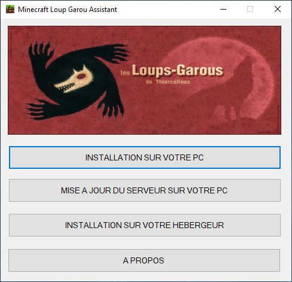

[Documentation pour le mode Minecraft Loup Garou de Squeezie.](https://jvin042.github.io/minecraft-loup-garou-wiki)

## Prérequis

- Java - [https://www.java.com/fr/download](https://www.java.com/fr/download) 

- Microsoft .NET Framework 4.6

## Utilisation

- Télécharger la dernière version du logiciel disponible [ici](https://github.com/jvin042/minecraft-loup-garou-assistant/releases) !

- Lancer le logiciel.